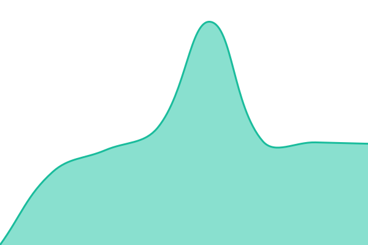

# [📈 Live Status](https://status.bbmri-eric.eu): <!--live status--> **🟩 All systems operational**

This repository contains the open-source uptime monitor and status page for [Upptime](https://upptime.js.org), powered by [Upptime](https://github.com/upptime/upptime).

With [Upptime](https://upptime.js.org), you can get your own unlimited and free uptime monitor and status page, powered entirely by a GitHub repository. We use [Issues](https://github.com/upptime/upptime/issues) as incident reports, [Actions](https://github.com/bbmri-eric/status/actions) as uptime monitors, and [Pages](https://status.bbmri-eric.eu) for the status page.

<!--start: status pages-->
<!-- This summary is generated by Upptime (https://github.com/upptime/upptime) -->
<!-- Do not edit this manually, your changes will be overwritten -->
<!-- prettier-ignore -->
| URL | Status | History | Response Time | Uptime |
| --- | ------ | ------- | ------------- | ------ |
|  [BBMRI-ERIC](https://www.bbmri-eric.eu) | 🟩 Up | [bbmri-eric.yml](https://github.com/BBMRI-ERIC/status/commits/HEAD/history/bbmri-eric.yml) | 

 3033ms
     
 | 

<a href="https://status.bbmri-eric.eu/history/bbmri-eric">100.00%</a>
    

|  [Negotiator](https://negotiator.bbmri-eric.eu) | 🟩 Up | [negotiator.yml](https://github.com/BBMRI-ERIC/status/commits/HEAD/history/negotiator.yml) | 

 867ms
     
 | 

<a href="https://status.bbmri-eric.eu/history/negotiator">100.00%</a>
    

|  [Directory](https://directory.bbmri-eric.eu) | 🟩 Up | [directory.yml](https://github.com/BBMRI-ERIC/status/commits/HEAD/history/directory.yml) | 

 1390ms
     
 | 

<a href="https://status.bbmri-eric.eu/history/directory">100.00%</a>
    

|  [Helpdesk](https://helpdesk.bbmri-eric.eu/RT) | 🟩 Up | [helpdesk.yml](https://github.com/BBMRI-ERIC/status/commits/HEAD/history/helpdesk.yml) | 

 891ms
     
 | 

<a href="https://status.bbmri-eric.eu/history/helpdesk">100.00%</a>
    

|  [LifeScience Login](https://login.aai.lifescience-ri.eu/oidc/.well-known/openid-configuration) | 🟩 Up | [life-science-login.yml](https://github.com/BBMRI-ERIC/status/commits/HEAD/history/life-science-login.yml) | 

 1614ms
     
 | 

<a href="https://status.bbmri-eric.eu/history/life-science-login">100.00%</a>
    

|  [LifeScience Login IdM (Perun)](https://perun.aai.lifescience-ri.eu) | 🟩 Up | [life-science-login-id-m-perun.yml](https://github.com/BBMRI-ERIC/status/commits/HEAD/history/life-science-login-id-m-perun.yml) | 

 1318ms
     
 | 

<a href="https://status.bbmri-eric.eu/history/life-science-login-id-m-perun">100.00%</a>
    

|  [Locator](https://locator.bbmri-eric.eu) | 🟩 Up | [locator.yml](https://github.com/BBMRI-ERIC/status/commits/HEAD/history/locator.yml) | 

 818ms
     
 | 

<a href="https://status.bbmri-eric.eu/history/locator">100.00%</a>
    

|  [BBMRI.de Sample Locator](https://samplelocator.bbmri.de) | 🟩 Up | [bbmri-de-sample-locator.yml](https://github.com/BBMRI-ERIC/status/commits/HEAD/history/bbmri-de-sample-locator.yml) | 

 1035ms
     
 | 

<a href="https://status.bbmri-eric.eu/history/bbmri-de-sample-locator">100.00%</a>
    

|  [BBMRI.cz Data Catalogue](https://data.bbmri.cz) | 🟩 Up | [bbmri-cz-data-catalogue.yml](https://github.com/BBMRI-ERIC/status/commits/HEAD/history/bbmri-cz-data-catalogue.yml) | 

 1428ms
     
 | 

<a href="https://status.bbmri-eric.eu/history/bbmri-cz-data-catalogue">100.00%</a>
    

<!--end: status pages-->

[**Visit our status website →**](https://status.bbmri-eric.eu)

## 📄 License

- Powered by: [Upptime](https://github.com/upptime/upptime)
- Code: [MIT](./LICENSE) © [Upptime](https://upptime.js.org)
- Data in the `./history` directory: [Open Database License](https://opendatacommons.org/licenses/odbl/1-0/)
